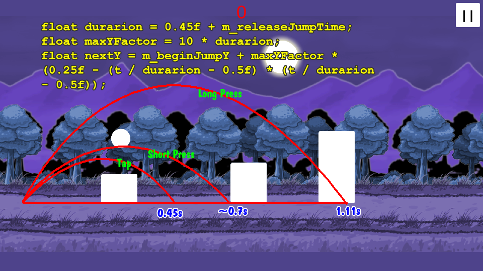

## Core Gameplay:
* The circle only has one action is jump. Because it is scrolling game, the Physic engine couldn't control the movement correctly. So I'll handle it manualy but still used physic engine to check collision.
* Just jump is so simple, may we can do some thing hardcore as Flappy bird, but I don't like to do so. I let the circle can jump more far by keep press in a time.
* Now, I need a function to calculate circle coordinates by time that I can control how far and how tall.
```The speed x was be normalize with time. It mean in t time, circle will be moved t unit.```
```When pressed jump, we want cirle'll jump in [duration] time (moved [duration] unit in x coordinate). I has this:```
```
y = (0.25f - (t / durarion - 0.5f) * (t / durarion - 0.5f))
```

```
when t = 0 then y = 0.
when t = durarion then y = 0.
Maximium y = 0.25 (unit).
To control how tall. I multiply it with a maxYFactor.
```

```
y = maxYFactor * (0.25f - (t / durarion - 0.5f) * (t / durarion - 0.5f))
```


## Manual Movement handle
* We just need Physics2D to check collision.
```
Physics2D.autoSimulation = false;
...
Physics2D.Simulate(dtTime);
```
* In the circle. The rigidbody2D.velocity.x always be fixed. When jumping, the rigidbody2D.velocity.y will be calculate follow above idea. The jump action will be break it the cirle enter collision with the Ground. The final position will be calculate base on that rigidbody2D.velocity and time.

## Random Obstacles
* Base on core gameplay, basiclly we has 3 three kind obstacles matched with 3 kind of jumps (tap, short press, long press). We can make it more difficult by make obstacle moving,... but in this step we just care about which action we expected player do. Let call it is: SHORT_JUMP, MEDIUM_JUMP, LONG_JUMP
* The expect actions will is a list jumps with some gap time. EX:
`SHORT_JUMP [1s] SHORT_JUMP[1s] MEDIUM_JUMP [2s] SHORT_JUMP[1s] LONG_JUMP [1s] SHORT_JUMP[1s] ...`
* Improve the feeling by make it has own beat. EX:
```SHORT_JUMP SHORT_JUMP MEDIUM_JUMP [2s] SHORT_JUMP LONG_JUMP [1s],...```
* For more detail please check on LevelGenerator.cs

## Pooling technique
* We'll preload minimium objects required for game at begin, show the loading popup until it has finished.
```
m_loadingLayer.Show();
GameObjectPreloader.Fetch(() =>{
	m_loadingLayer.Hide();
});
```
* The preload objects will be load one by one in a StartCoroutine. In case we need an object the hasn't been loadded, it'll be forced to load it.
* We don't load everything to screen. We just load the object when it is in about 10 unit(1200 pixel) with the circle.
* Each time generator a new part of game. We has enough infomation to preload the objects before it was be used.

## Leaderboard Service Information
Leaderboard service doesn't exist yet, but will be built at a future time. It will be call when showing reult popup.
```
WWWForm form = new WWWForm ();
form.AddField ("userName", OnlinePlayerProfile.Instance.dataInfo.m_localId);
form.AddField ("score", score);
GameServerAPI.Instance.PostAPI ("leaderboard", form, (err, data) => {
	if(err != null){
		Debug.LogError(err.errorMessage);
	}
});
```
